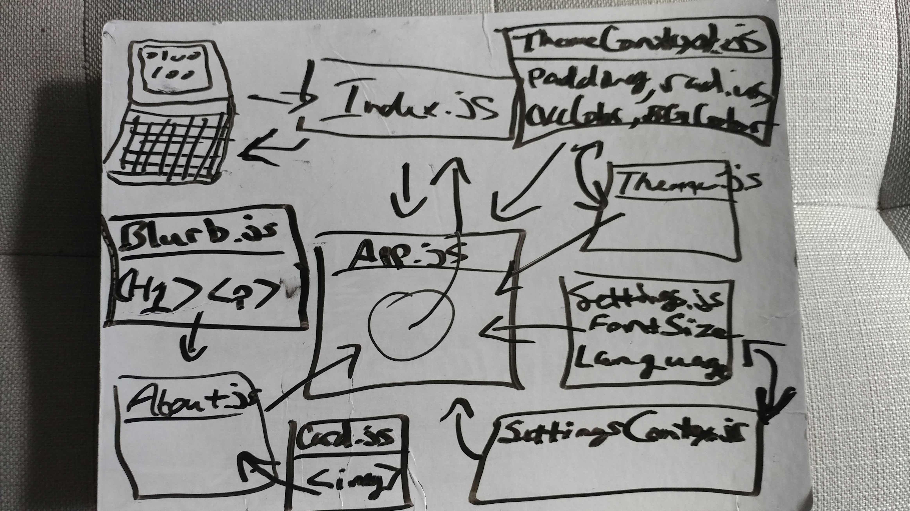

# LAB - 24 Context API

## Author: James Dunn

### Links and Resources

- [Sandbox URL](https://codesandbox.io/embed/lab-24-p5hvp?fontsize=14&hidenavigation=1&theme=dark)

- [Netlify Site](https://sb-p5hvp.netlify.com)

### Instructions

#### In order to run this app, just adjust the input values. Changing any of the values in the Themes and Settings boxes will dynamically alter the designated properties on elements on the page.

### UML

